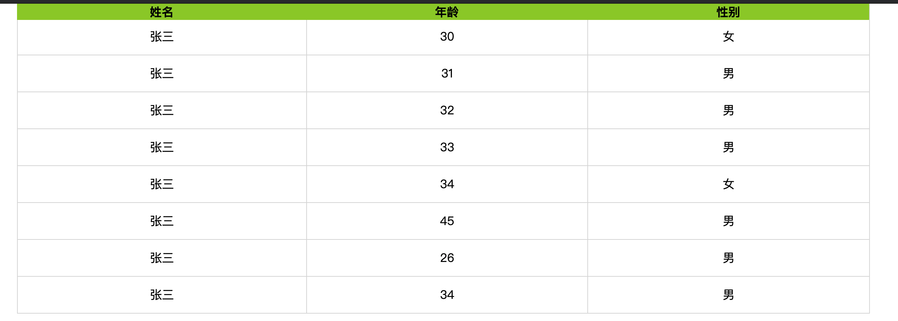
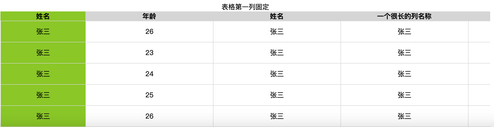

# table-sticky
demo:  https://dream-wu.github.io/table-sticky/
# position: sticky
利用position 属性， 简单实现表格的粘顶、固定某列效果

## 1、表头顶部粘顶效果
使用场景： 表格内容很长，超过一屏。滑动滚动时，表头固定，方便查看，数据所对应的列
 
## 2、第一列固定
使用场景：表格列很多，需要滚动查看所有的列，固定第一列以便查看数据所对应的第一列信息。
 